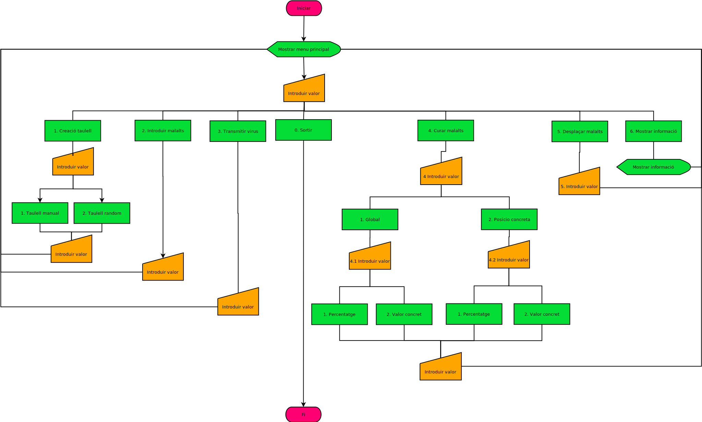
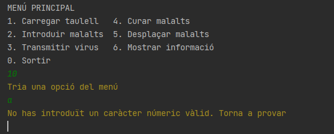
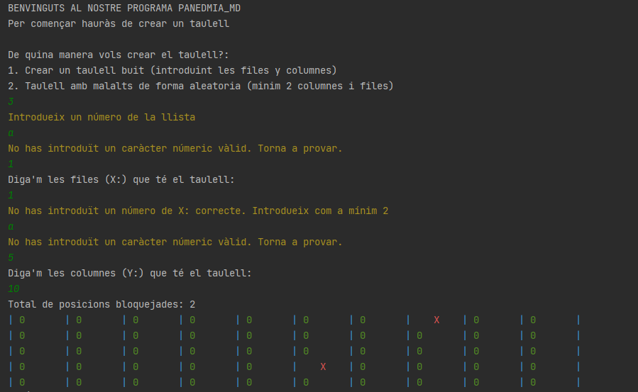
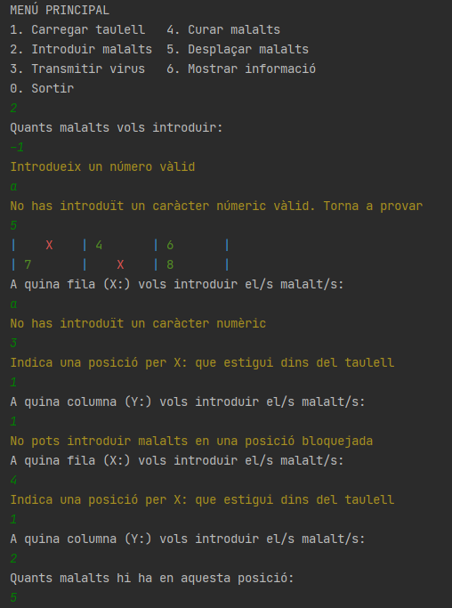
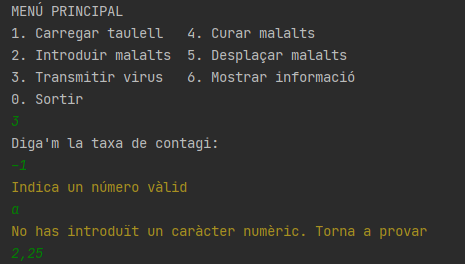
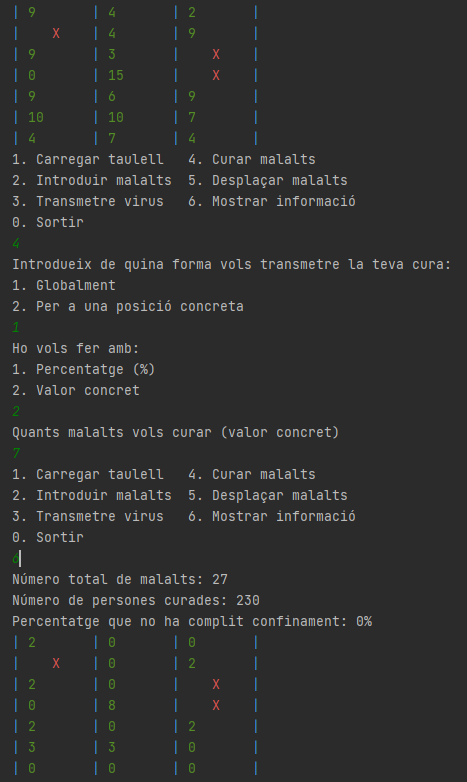
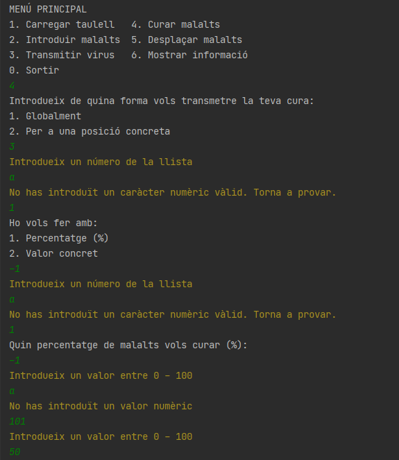
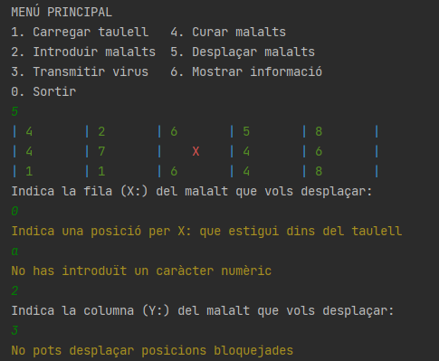
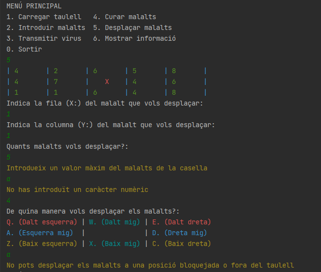

# Pandemia_MD :shipit:
Projecte Pandemia Morel i Daniel

# Esquema Principal del Projecte

# Explicació Decisions de Disseny Preses
 * Primerament vam haver d'analitzar els apartats que conté aquest projecte i entendre el que se'ns demanava.
 * Una vegada fet això podiem prendre decisions sobre com codificar el nostre programa de la manera més òptima i efectiva (l'ordre en que haviem de codificar els apartats, tenir en compte els tipus de variables que hauriem d'utilitzar juntament amb les estructures de control...).
 * Finalment quedava implementar el nostre codi tal i com haviem pensat. Per alguns apartats teniem una idea principal la qual vam haver de rectifiar perquè no teniem els coneixements suficients per dur a terme aquesta idea. **Per exemple**:
 
   - Començant el projecte ens vam adonar que a l'hora de mostrar l'array aquesta hauria de mostrar contingut alfanumèric (0-9, X). Com vam fer una array numèrica vam pensar que haviem de fer una altra alfanumèrica, però a l'hora de codificar aquesta proposta vam veure que no era la més adecuada tenint en compte els nostres coneixements.
   - A mesura que codificavem el nostre projecte ens vam adonar que quan voliem mostrar el nostre taulell per realitzar diferents apartats, hi havia codi redundant. Això ho vam solucionar fent un "**Method**", que ens serveix per indicar un bloc de codi que volem utilitzar al llarg del programa i que a l'hora d'utilitzar-lo, només hem de fer referència al nom d'aquest "**Method**" a l'apartat on volem que aquest bloc de codi funcioni, i així evitem redundància.
   - També ens vam adonar de que el format amb el qual es mostrava el taulell no ens agradava i vam decidir utilitzar un "**printf**" per donar format i a més a més vam declarar unes "**Constants**" que definien un color, que també se li va aplicar a aquest taulell i a altres blocs del codi per donar estil.

# Distribució de funcions
Per que el codi estigués ben estructurat i sigui bonic i senzill vam decidir separar-lo en diferents classes i funcions. Per explicar el següent apartat ho farem divint l'explicació en cadascuna de les classes que hem creat.

### Classe "Pandemia_MD"
Aquesta classe conté el main. Aquest crida a la funció "inici" que és la funció principal que crida a la resta de funcions.
 * **Funció inici()**
    - Programa principal cridat des del main de la classe. Mostra el menú per pantalla i segons la opció triada executa una o altre instrucció fins que aquesta opció sigui la de sortir

### Classe "GestorTaulell"
En aquesta classe tenim les funcions que es dediquen a modificar les dades del taulell.
 * **Funció carregarDades()**
    - Funció que serveix per carregar dades al taulell, tant si es vol crear un taulell aleatori com si es vol crear un amb mesures introduïdes per l'usuari. Aquesta funció la utilitzem per crear el primer taulell però es pot tornar a utilitzar durant l'execució del programa.
 * **Funció introduirMalalts()**
    - Funció que ens permet introduïr malalts al nostre taulell i no només en una sola cel·la, sino que els podem repartir en varies cel·les (aquí entra la nostra proposta de millora).
 * **Funció transmetreVirus()**
    - Funció que ens permet trasnmetre virus aplicant una taxa de contagi.
 * **Funció curarMalalts()**
    - Funció que ens permet curar maltalts. Es pot fer de dues maneres: 1 - De forma global, 2 - A una casella concreta. En ambdós casos es pot decidir si es vol curar amb % o amb un valor concret.
 * **Funció curarMalaltsValorConcret()**
    - Funció que ens verifica que quan curem malalts amb un valor concret no estiguem en una posició bloquejada ni estiguem curant més persones que les que hi ha malaltes en aquella casella.
 * **Funció desplacarMalalts()**
    - Funció que ens serveix per desplaçar malalts d'una cel·la a un altre. Es pot desplaçar a qualsevol cel·la colindant sempre que no sigui una posició bloquejada o estigui fora del taulell.

### Classe "Taulell"
Classe on es crea i es modifica l'estructura del Taulell.
 * **Funció Taulell()**
   - Inicialitzem el taulell a 0 per files i columnes.
 * **Funció Taulell(int f,int c)**
   - Una vegada demanem les files y les columnes les assignem al taulell perquè tingui les dimensions que volem.
 * **Funció getFiles()**
   - Funció per obtenir les files del nostre taulell.
 * **Funció setFiles()**
   - Funció per modificar les files del nostre taulell passant-li un nou valor.
 * **Funció getColumnes()**
   - Funció per obtenir les columnes del nostre taulell.
 * **Funció setColumnes()**
   - Funció per modificar les columnes del nostre taulell passant-li un nou valor.
 * **Funció getTaulell()**
   - Funció per obtenir el nostre taulell.
 * **Funció setTaulell()**
   - Funció per modificar el taulell i assignar-li nous valors.
 * **Funció createTaulell()**
   - Funció per crear el taulell ja sigui de forma manual o de forma aleatoria.
  
### Classe "Interficie"
 * **Funció mostrarMenu()**
   - Mostra per pantalla les diferents opcions que formen els menús.
 * **Funció mostrarMenuDesplacar()**
   - Funció que mostra el menú de desplaçament de la opció "Desplaçar malalts" del programa.
 * **Funció mostrarTaulell()**
   - Funció que mostra el taulell formatat i personalitzat de la manera que nosaltres volem
 * **Funció mostrarMissatge()**
   - Mostra per pantalla el missatge simple o normal que nosaltres li passem
 * **Funció mostrarMissatgeError()**
   - Mostra per pantalla el missatge de error que nosaltres li passem
 * **Funció mostrarMissatgeSortida()**
   - Mostra per pantalla el missatge de sortida que nosaltres li passem
 * **Funció mostrarEstadistiques()**
   - Funció que mostra les estadistiques respecte a la situació actual del taulell
 * **Funció mostrarInformacio()**
   - Funció que ens mostra la situació actual del taulell
    
### Classe "Utils"
 * **Funcio validarEnter()**
   - Solicita un enter fins que sigui correcte.
 * **Funció validarTaxaContagi()**
   - Solicita un float fins que sigui correcte.
 * **Funció validarCasellaDesti()**
   - Funció que ens permet validar si la casella de destí quan desplaçem un malalt és una posició bloquejada, esta fora del taulell o es una posició vàlida.
 * **Funció validarLletraCasella()**
   - Funció que ens permet validar si la lletra que escriu l'usuari per moure malalts no és un número i està dins de les lletres que es demanen.

# Explicació Repartiment de Tasques
En el nostre cas nos ens hem atabalat molt, hem fet els apartats intercalats però això no vol dir que els hagim fet per separat o incomunicats. Mitjançant "Discord" hem fet trucades per realitzar cadascun dels apartats del projecte fos el que ens toquès a nosaltres o no, comentant codi, errors, fent proves... A més a més si no ens tocava realitzar un apartat el dia que feiem trucada, procuravem ajudar, buscar informació, intentar solucionar problemes... per tal de possar de la nostra part.  

# Joc de Proves

### Menú Principal
#### Cas Extrem (Amb la classe "Utils"):

* Dades introduïdes a les variables utilitzades
    - **answer:** 10

Com es pot apreciar s'ha possat el programa a prova en diferents situacions on aquest podria haver fallat o podria haver-se col·lapsat.
Gràcies a que disposem de la classe "Utils" que valida tota entrada que fa l'usuari, el programa
continua executant-se fins que s'introdueix un paràmetre vàlid
(En aquest cas no pot seleccionar un número que no sigui de la llista del menú ni tampoc pots entrar caràcters alfabètics).

### Carregar Taulell

#### Cas 1:

* Dades introduïdes a les variables utilitzades
  - **answer:** 1
  - **answerBoard:** 1
  - **x:** 5, **y:** 10
  
En aquest cas el que es fa és crear un taulell buit amb les mesures que et dona l'usuari.
Primerament seleccionem que volem utilitzar la opció "1" del menú.
Una vegada fet això ens demanarà si volem crear un taulell buit o si volem crear un taullel amb mesures random. Introduïm "1" perquè l'usuari ens pugui donar les mesures del taulell.
Seguidament se'ns demanen les mesures. En aquest hem fet un taulell de 5 x 10 (5 files, 10 columnes). A més a més, tot taulell es crea amb un interval de 0-3 posicions bloquejades.

#### Cas 2:

* Dades introduïdes a les variables utilitzades
  - **answer:** 1
  - **answerBoard:** 2

En aquest cas el que es fa és crear un taulell amb mesures aleatories.
Primerament seleccionem que volem utilitzar la opció "1" del menú.
Una vegada fet això ens demanarà si volem crear un taulell buit o si volem crear un taullel amb mesures random. Introduïm "2" per agafar l'opció del taulell random.
Seguidament se'ns crea el taulell amb mesures aleatories (el programa indica quines són) i també conté posicions bloquejades.

#### Cas Extrem (Amb la classe "Utils"):

* Dades introduïdes a les variables utilitzades
    - **answer:** 1
    - **answerBoard:** 1
    - **x:** 5, **y:** 10
    
Com es pot apreciar s'ha possat el programa a prova en diferents situacions on aquest podria haver fallat o podria haver-se col·lapsat. 
Gràcies a que disposem de la classe "Utils" que valida tota entrada que fa l'usuari, el programa
continua executant-se fins que s'introdueix un paràmetre vàlid (En aquest cas ha de ser un número superior a 2 degut a que no té sentit tenir un taulell més petit de 2x2).

### Introduir malalts

#### Cas 1:

* Dades introduïdes a les variables utilitzades:
  - **answer:** 2
  - **patients:** 5
  - **x:** 3, **y:** 1
  - **positionPatients:** 5
  
En aquest cas el que es fa és introduir malalts en una posició seleccionada per l'usuari.
Primerament seleccionem que volem utilitzar la opció "2" del menú.
Una vegada fet això ens demanarà quants malalts volem introduir. (5 en el nostre exemple).
Seguidament ens mostra el nostre taulell i ens pregunta a quina fila i a quina columna volem introduir el malalt (3 1 en el nostre cas)
Per finalitzar ens diu que quants del 5 malalts volem introduir en aquesta posició introduïda (volem introduir els 5 malalts en aquest exemple).

#### Cas Extrem:

* Dades introduïdes a les variables utilitzades:
  - **answer:** 2
  - **patients:** 5
  - **x:** 3, **y:** 1
  
En aquest cas el que es fa és introduir malalts en una posició seleccionada per l'usuari.
Primerament seleccionem que volem utilitzar la opció "2" del menú.
Una vegada fet això ens demanarà quants malalts volem introduir. (5 en el nostre exemple).
Seguidament ens mostra el nostre taulell i ens pregunta a quina fila i a quina columna volem introduir el malalt (3 1 en el nostre cas)
Per finalitzar com la posició especificada resulta ser una posicio bloquejada el programa ens comunica que no es posible realitzar aquesta operació i torna al menú principal.

#### Cas Extrem (Amb la classe "Utils"):

* Dades introduïdes a les variables utilitzades
    - **answer:** 2
    - **patients:** 5
    - **x:** 1, **y:** 2

Com es pot apreciar s'ha possat el programa a prova en diferents situacions on aquest podria haver fallat o podria haver-se col·lapsat.
Gràcies a que disposem de la classe "Utils" que valida tota entrada que fa l'usuari, el programa
continua executant-se fins que s'introdueix un paràmetre vàlid 
(En aquest cas ha de ser una fila i columna que estigui al taulell i que no estigui bloquejada. A més els malalts que s'introdueixen ha de ser un número positiu).

### Transmitir virus

#### Cas 1:

* Dades introduïdes a les variables utilitzades:
  - **answer:** 3
  - **infectionRate:** 1,25

En aquest cas el que es fa és aplicar una taxa de contagi especificada per l'usuari a tot el taulell.
Primerament seleccionem que volem utilitzar la opció "3" del menú.
Una vegada fet això ens demanarà quina volem que sigui la taxa de contagi. (1,25 en el nostre exemple).
Finalment s'aplica aquesta taxa a tot el taulell.

#### Cas Extrem (Amb la classe "Utils"):

* Dades introduïdes a les variables utilitzades
    - **answer:** 2
    - **infectionRate:** 2,25

Com es pot apreciar s'ha possat el programa a prova en diferents situacions on aquest podria haver fallat o podria haver-se col·lapsat.
Gràcies a que disposem de la classe "Utils" que valida tota entrada que fa l'usuari, el programa
continua executant-se fins que s'introdueix un paràmetre vàlid
(En aquest cas la taxa de contagi no pot ser negativa ni un caràcter alfabètic).

### Curar malalts

#### Cas 1: Curar globalment amb %:

* Dades introduïdes a les variables utilitzades:
  - **answer:** 4
  - **answerCure:** 1 
  - **answerCureValue:** 1 
  - **cureNumber:** 50

En aquest cas el que es fa és curar malalts seleccionant si volem fer-ho de manera global o per una posició concreta. En ambdós casos la cura es pot fer mitjançant un % o mitjançant un valor concret.
Primerament seleccionem que volem utilitzar la opció "4" del menú.
Una vegada fet això ens pregunta com volem aplicar la cura (Globalment o per una posició concreta). Introduïm "1" per fer-ho globalment.
Seguidament ens preguntarà si volem aplicar la cura amb un % o amb un valor concret. Introduïm "1" per fer-ho amb %.
Finalment introduïm el % que volem curar i s'aplicarà correctament.

#### Cas 2: Curar globalment amb valor concret:

* Dades introduïdes a les variables utilitzades:
  - **answer:** 4
  - **answerCure:** 1 
  - **answerCureValue:** 2 
  - **cureNumber:** 7

En aquest cas el que es fa és curar malalts seleccionant si volem fer-ho de manera global o per una posició concreta. En ambdós casos la cura es pot fer mitjançant un % o mitjançant un valor concret.
Primerament seleccionem que volem utilitzar la opció "4" del menú.
Una vegada fet això ens pregunta com volem aplicar la cura (Globalment o per una posició concreta). Introduïm "1" per fer-ho globalment.
Seguidament ens preguntarà si volem aplicar la cura amb un % o amb un valor concret. Introduïm "2" per fer-ho amb un valor concret.
Finalment introduïm el valor que volem curar i s'aplicarà correctament. En el cas de que tinguem 2 malalts en una posició i nosaltres volguessim curar 7 persones, simplement el taulell mostraria 0 perquè s'han curat totes les persones d'aquella posició.

#### Cas 3: Curar posició concreta amb %:

* Dades introduïdes a les variables utilitzades:
  - **answer:** 4
  - **answerCure:** 2
  - **x:** 3, **y:** 1 
  - **answerCureValue:** 1
  - **cureNumber:** 50

En aquest cas el que es fa és curar malalts seleccionant si volem fer-ho de manera global o per una posició concreta. En ambdós casos la cura es pot fer mitjançant un % o mitjançant un valor concret.
Primerament seleccionem que volem utilitzar la opció "4" del menú.
Una vegada fet això ens pregunta com volem aplicar la cura (Globalment o per una posició concreta). Introduïm "2" per fer-ho per una posició concreta.
Seguidament ens preguntarà si volem aplicar la cura amb un % o amb un valor concret. Introduïm "1" per fer-ho amb un %.
Finalment introduïm el % que volem curar i s'aplicarà correctament a aquella posició.

#### Cas 4: Curar posició concreta amb valor concret:

* Dades introduïdes a les variables utilitzades:
  - **answer:** 4
  - **answerCure:** 2
  - **x:** 0, **y:** 0 
  - **answerCureValue:** 2
  - **cureNumber:** 1

En aquest cas el que es fa és curar malalts seleccionant si volem fer-ho de manera global o per una posició concreta. En ambdós casos la cura es pot fer mitjançant un % o mitjançant un valor concret.
Primerament seleccionem que volem utilitzar la opció "4" del menú.
Una vegada fet això ens pregunta com volem aplicar la cura (Globalment o per una posició concreta). Introduïm "2" per fer-ho per una posició concreta.
Seguidament ens preguntarà si volem aplicar la cura amb un % o amb un valor concret. Introduïm "2" per fer-ho amb un valor concret.
Finalment introduïm el valor que volem curar (aquest no podrà ser superior al número de malalts d'una casella) i s'aplicarà correctament a aquella posició.

#### Cas Extrem:

* Dades introduïdes a les variables utilitzades:
  - **answer:** 4
  - **answerCure:** 2
  - **x:** 0, **y:** 0 
  - **answerCureValue:** 2
  - **cureNumber:** 5

En aquest cas el que es fa és curar malalts seleccionant si volem fer-ho de manera global o per una posició concreta. En ambdós casos la cura es pot fer mitjançant un % o mitjançant un valor concret.
Primerament seleccionem que volem utilitzar la opció "4" del menú.
Una vegada fet això ens pregunta com volem aplicar la cura (Globalment o per una posició concreta). Introduïm "2" per fer-ho per una posició concreta.
Seguidament ens preguntarà si volem aplicar la cura amb un % o amb un valor concret. Introduïm "2" per fer-ho amb un valor concret.
Finalment introduïm el valor que volem curar (aquest no podrà ser superior al número de malalts d'una casella) i com podem veure encara que el número que volem curar es superior al número de malalts de la posició el programa cura els malalts fins arribar a 0, sense posar números negatius.

#### Cas Extrem (Amb la classe "Utils"):

* Dades introduïdes a les variables utilitzades
    - **answer:** 4
    - **answerCure:** 1
    - **answerCureValue:** 1
    - **cureNumber:** 50

Com es pot apreciar s'ha possat el programa a prova en diferents situacions on aquest podria haver fallat o podria haver-se col·lapsat.
Gràcies a que disposem de la classe "Utils" que valida tota entrada que fa l'usuari, el programa
continua executant-se fins que s'introdueix un paràmetre vàlid
(En aquest cas no pots curar negativament. Ara bé, si es cura per % no es pot curar més d'un 100%, però si és amb valor concret, no es pot curar més malalts del que pertanyin a aquella casella).

### Desplaçar malalts:

#### Cas 1:

* Dades introduïdes a les variables utilitzades:
  - **answer:** 5
  - **x:** 1, **y:** 2
  - **patients:** 2
  - **answerDisplace:** z

En aquest cas el que es fa és desplaçar els malalts de una posició a totes les que li envolten.
Primerament seleccionem que volem utilitzar la opció "5" del menú.
Una vegada fet això ens mostrar el taulell i indicarem la posició on estan els "2" malalts que volem desplaçar, en aquest cas sera x:"1" i y:"2".
Seguidament ens preguntarà quants malalts volem desplaçar.
Finalment ens mostrara un petit menu amb les lletres i introduírem "z" per moure'l "Baix esquerra".
Entrant a la opció "6" del menú podem veure com els malalts s'han desplaçats de la posició x:"1" y:"2" a la x:"2" y:"1".

#### Cas 2:

* Dades introduïdes a les variables utilitzades:
  - **answer:** 5
  - **x:** 5, **y:** 0
  - **patients:** 3
  - **answerDisplace:** W

En aquest cas el que es fa és desplaçar els malalts de una posició a totes les que li envolten.
Primerament seleccionem que volem utilitzar la opció "5" del menú.
Una vegada fet això ens mostrar el taulell i indicarem la posició on estan els "3" malalts que volem desplaçar, en aquest cas sera x:"5" i y:"0".
Seguidament ens preguntarà quants malalts volem desplaçar.
Finalment ens mostrara un petit menu amb les lletres i introduírem "W"(encara que es posi en mayúscula el programa podra entendre quina opció estas indicant) per moure'l "Dalt mig".
Entrant a la opció "6" del menú podem veure com els malalts s'han desplaçats de la posició x:"5" y:"0" a la x:"4" y:"0".

#### Cas 3:

* Dades introduïdes a les variables utilitzades:
  - **answer:** 5
  - **x:** 2, **y:** 0
  - **patients:** 1
  - **answerDisplace:** d

En aquest cas el que es fa és desplaçar els malalts de una posició a totes les que li envolten.
Primerament seleccionem que volem utilitzar la opció "5" del menú.
Una vegada fet això ens mostrar el taulell i indicarem la posició on esta el malalt que volem desplaçar, en aquest cas sera x:"5" i y:"0".
Seguidament ens preguntarà quants malalts volem desplaçar, en aquets cas hi han 2 malalts però només desplaçarem "1". Aixó vol dir que l'usuari pot agafar part dels malalts d'una posició i no agafarlos tots si o si.
Finalment ens mostrara un petit menu amb les lletres i introduírem "W"(encara que es posi en mayúscula el programa podra entendre quina opció estas indicant) per moure'l "Dalt mig". 
Entrant a la opció "6" del menú podem veure com els malalts s'han desplaçats de la posició x:"5" y:"0" a la x:"4" y:"0".

#### Cas Extrem:

* Dades introduïdes a les variables utilitzades:
  - **answer:** 5
  - **x:** 1, **y:** 1
  - **patients:** 1
  - **answerDisplace:** d

En aquest cas el que es fa és desplaçar els malalts de una posició a totes les que li envolten.
Primerament seleccionem que volem utilitzar la opció "5" del menú.
Una vegada fet això ens mostrar el taulell i indicarem la posició on esta el malalt que volem desplaçar, en aquest cas sera x:"1" i y:"1".
Seguidament ens preguntarà quants malalts volem desplaçar, en aquets cas desplaçarem "1".
Finalment ens comunica que no es pot realitzar aquesta operació degut a que estem intentant desplaçar el malalt a una posició bloquejada. S'ha de tenir en compte que no es pot desplaçar malalts fora del taulell o a una posició bloquejada.

#### Cas Extrem (Amb la classe "Utils"):

* Dades introduïdes a les variables utilitzades
    - **answer:** 5
    - **x:** 2, **y:** 3

Com es pot apreciar s'ha possat el programa a prova en diferents situacions on aquest podria haver fallat o podria haver-se col·lapsat.
Gràcies a que disposem de la classe "Utils" que valida tota entrada que fa l'usuari, el programa
continua executant-se fins que s'introdueix un paràmetre vàlid
(En aquest cas no pots desplaçar posicions bloquejades. Tampoc pot desplaçar malalts a una posició bloquejada o a una posició que estigui fora del taulell).

### Mostrar informació:

#### Cas 1:

* Dades introduïdes a les variables utilitzades:
  - **answer:** 6
  
En aquest cas el que es fa és mostrar a l'usuari el número total de malalts, persones curades i un percentatge de les persones que no han complit el confinament.
Totes aquestes dades estan asociades al taulell i a les operacions que es facin en el mateix a partir de les opcions del menú en cas de crear altre taulell es resetejaran els totals i el percentatge.
A més es mostrara a continuació el taulell.

### Sortir:

#### Cas 1:

* Dades introduïdes a les variables utilitzades:
  - **answer:** 0
  
En aquest cas el que es fa és mostrar un missatge de comiat i a continuació s'atura el programa.

# Proposta de millora

La nostra proposta de millora està basada en l'apartat "Introduir malalts".
De base, aquesta opció ens permitia només introduir una quantitat de malalts en una posició del taullel determinada. Amb la nostra millora hem fet que l'usuari pugui introduir una quantitat de malalts, però amb la diferència de que no necessariament tots els malalts que vulgui introduir han d'estar a la mateixa posició, els pot distrbuir en diferents caselles fins a arribar al número de malalts que s'havia especificat per inserir. No es pot superar aquest número, sino el programa ens mostraria un missatge d'error de que hem superat el número de malalts que haviem especificat.
